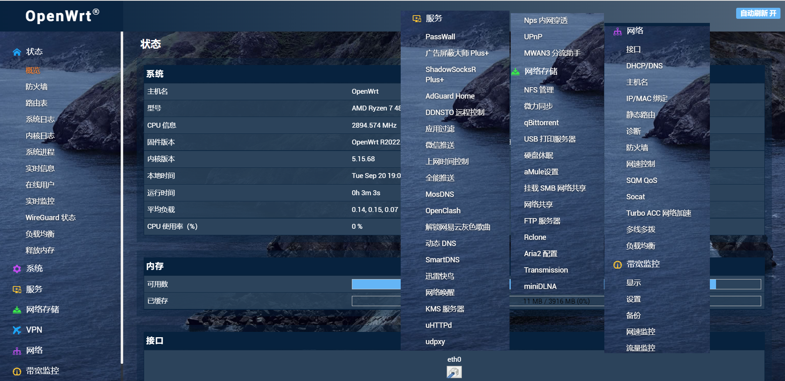
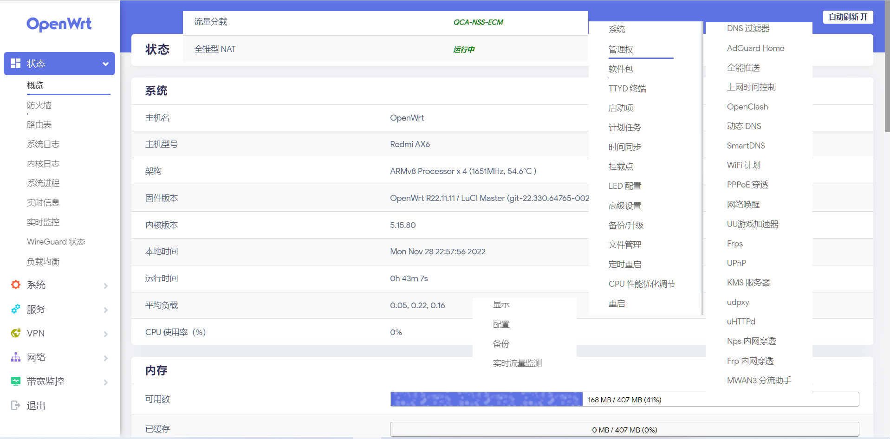

## 不太会写这个文件见谅
   

## OpenWrtBuild_Occupied有哪些功能？

* 固件每天定时自动编译，以确保获得最新体验
    *  集成绝大多数网卡驱动
    *  固件包含docker（新版本已经不含docker了，因为会影响udp性能）
    *  XFS文件系统固件
* 项目使用 Github Actions 拉取源码仓库进行云编译
* 项目编译的固件插件为最新版本，最新版插件可能有 BUG，如果之前使用稳定则无需追新
* 第一次使用请采用全新安装，避免出现升级失败以及其他一些可能的 BUG

## 自动编译范围
自动拉取上游源码并编译固件，项目包含

* `X86` 
   *  
   * 
* `R2S/R86S等`
   * 

* `AX6`
* 项目废弃，全资源转投qsdk12开发
   * 
   *  
* `Qihoo` 不是我吐槽，Lean这种大神还需要抄别人代码的吗，已经连续两次把我发给他的文件直接传github了
* 项目废弃，全资源转投qsdk12开发
   *  

## 参考项目
早期自动编译参考klever1988，新版参考haiibo大佬。谢谢各位大佬对开源社区的风险和付出，写一个免费的东西，有欣喜，也还有汗水，希望你喜欢我的作品，同时也能支持一下。

## 感激
感谢以下的项目,排名不分先后

* ImmortalWrt Openwrt P3TERX 以及一切为社区默默奉献的大佬们

## 关于作者
因为有些代码是复制的，所以如果有些硬代码对原有库造成影响，十分抱歉 特别感谢
